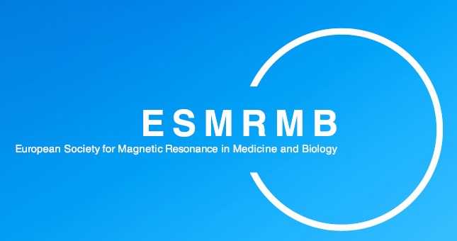
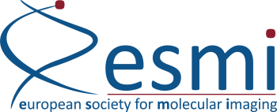
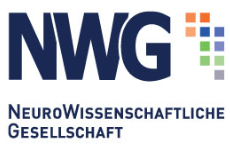

## 2024

- 

    <strong>Conference:</strong> Neuroprotection & Neurorepair
    
  
 
  
  **Date:** 18 November - 20 November 2024  
  **Title:** Characterization of motor deficits in a mouse model of internal capsule stroke (talk)  
  **Presenter:** Markus Aswendt  
  **Location:** Potsdam, Germany  

- 

    <strong>Conference:</strong> Neuroprotection & Neurorepair
    
  
  
  
  **Date:** 18 November - 20 November 2024  
  **Title:** Tract masks for refined analysis of diffusion properties in motor tracts related to functional recovery after stroke in mice (talk)  
  **Presenter:** Aref Kalantari  
  **Location:** Potsdam, Germany  

- 

    <strong>Conference:</strong> Neuroprotection & Neurorepair
    
  
  
  
  **Date:** 18 November - 20 November 2024  
  **Title:** Advanced clustering of stroke recovery in mice (poster)  
  **Presenter:** Aref Kalantari  
  **Location:** Potsdam, Germany  

- 

    <strong>Conference:</strong> ESMRMB
    
  
  
  
  **Date:** 2 October - 5 October 2024  
  **Title:** Recurrence quantification of dynamic mouse brain networks derived from resting-state fMRI (talk)  
  **Presenter:** Aref Kalantari  
  **Location:** Barcelona, Spain  

- 

    <strong>Conference:</strong> ESMRMB
    
  
  
  
  **Date:** 2 October - 5 October 2024  
  **Title:** Atlas-based tract masks for refined analysis of diffusion MRI in mice with cortical stroke (talk)  
  **Presenter:** Markus Aswendt  
  **Location:** Barcelona, Spain  

- 

    <strong>Conference:</strong> European Molecular Imaging Meeting
    
  
  
  
  **Date:** 12 March - 15 March 2024  
  **Title:** Recurrence quantification of dynamic mouse brain networks derived from resting-state fMRI (talk)  
  **Presenter:** Markus Aswendt  
  **Location:** Porto, Portugal  

## 2023

- 

    <strong>Conference:</strong> European Molecular Imaging Meeting
    
  
  
  **Date:** 14 March - 17 March 2023  
  **Title:** How to produce and verify reliable MRI data: a standardized quality assessment approach (talk)  
  **Presenter:** Aref Kalantari  
  **Location:** Salzburg, Austria  

- 

    <strong>Conference:</strong> European Molecular Imaging Meeting
    
  
  
  
  **Date:** 13 March - 17 March 2023  
  **Title:** How to establish and maintain a multimodal animal MRI data repository (talk)  
  **Presenter:** Aref Kalantari  
  **Location:** Salzburg, Austria  

## 2022

- 

    <strong>Conference:</strong> European Molecular Imaging Meeting
    
  
  
  
  **Date:** 15 March - 18 February 2022  
  **Title:** Software tools for registration and analysis of multimodal, whole brain neuroimaging data (talk)  
  **Presenter:** Markus Aswendt  
  **Location:** Thessaloniki, Greece  

- 

    <strong>Conference:</strong> European Molecular Imaging Meeting
    
  
  
  
  **Date:** 15 March - 18 July 2022  
  **Title:** An automated tool for fast quality analysis of animal MRI (talk)  
  **Presenter:** Aref Kalantari  
  **Location:** Thessaloniki, Greece  

- 

    <strong>Conference:</strong> European Molecular Imaging Meeting
    
  
  
  
  **Date:** 15 March - 18 March 2022  
  **Title:** Standardisation of MRI instrumentation and protocols (talk)  
  **Presenter:** Markus Aswendt  
  **Location:** Thessaloniki, Greece  

- 

    <strong>Conference:</strong> DGKN
    
  
   
  
  **Date:** 10 March - 12 March 2022  
  **Title:** Transcranial direct current stimulation modulates stroke-induced secondary thalamic neurodegeneration in mice (talk)  
  **Presenter:** Blaschke S.  
  **Location:** Würzburg, Germany  

## 2021

- 

    <strong>Conference:</strong> Society for Neuroscience Meeting
    
  
  
  
  **Date:** 3 November - 11 November 2021  
  **Title:** Reactive Astrocytes Prevent Maladaptive Plasticity after Ischemic Stroke (talk)  
  **Presenter:** Markus Aswendt  
  **Location:** online 

- 

    <strong>Conference:</strong> European Molecular Imaging Meeting
    
  
  
  
  **Date:** 2 September - 3 September 2021  
  **Title:** Reactive gliosis is a critical pathophysiological component in normalization of functional connectivity after stroke (talk)  
  **Presenter:** Markus Aswendt  
  **Location:** online 

- 

    <strong>Conference:</strong> European Molecular Imaging Meeting
    
  
  
  
  **Date:** 24 August - 27 August 2021  
  **Title:** Reactive gliosis is a critical pathophysiological component in normalization of functional connectivity after stroke (poster)  
  **Presenter:** Markus Aswendt  
  **Location:** Göttingen, Germany  

- 

    <strong>Conference:</strong> Göttingen Meeting, German Neuroscience Society
    
  
  
  
  **Date:** 22 March - 22 March 2021  
  **Title:** Reactive astrocytes are necessary for spontaneous improvement of functional improvement and recovery after stroke (talk)  
  **Presenter:** Markus Aswendt  
  **Location:** online  

## 2020

- 

    <strong>Conference:</strong> European Molecular Imaging Meeting
    
  
  
  
  **Date:** 24 August - 28 August 2020  
  **Title:** Enhanced transhemispheric connectivity after cortical stroke in mice (poster)  
  **Presenter:** Markus Aswendt  
  **Location:** online 

## 2019

- 

    <strong>Conference:</strong> INCF Neuroinformatics
    
  
  
  
  **Date:** 1 September - 2 September 2019  
  **Title:** Automated atlas-based image analysis of in vivo and ex vivo rodent MRI data (talk)  
  **Presenter:** Niklas Pallast  
  **Location:** Warsaw, Poland  

- 

    <strong>Conference:</strong> OHBM
    
  
  
  
  **Date:** 9 June - 13 June 2019  
  **Title:** Transcranial direct current stimulation reverses stroke-induced hyperconnectivity in mice (talk)  
  **Presenter:** Blaschke S.  
  **Location:** Rome, Italy  

- **Conference:** Bonnbrain  
  **Date:** 25 March - 27 March 2019  
  **Title:** Automated atlas-based image analysis of in vivo and ex vivo rodent MRI data (talk)  
  **Presenter:** Niklas Pallast  
  **Location:** Bonn, Germany  

## 2018

- 

    <strong>Conference:</strong> Society for Neuroscience Meeting
    
  
  
  
  **Date:** 3 November - 7 November 2018  
  **Title:** Cloud-based relational database for managing large amounts of multimodal animal data (talk)  
  **Presenter:** Markus Aswendt  
  **Location:** San Diego, California, USA  

- 

    <strong>Conference:</strong> Neuroprotection & Neurorepair
    
  
  
  
  **Date:** 9 October - 11 October 2018  
  **Title:** Atlas-based lesion mapping for in vivo MRI and ex vivo histology of stroke mice (poster)  
  **Presenter:** Frederique Wieters  
  **Location:** Dresden, Germany  

- **Conference:** TOPIM  
  **Date:** 9 July - 14 July 2018  
  **Title:** High-throughput, Python-based processing pipeline for pre-clinical MRI data (talk)  
  **Presenter:** Niklas Pallast  
  **Location:** Crete, Greece  

- 

    <strong>Conference:</strong> European Molecular Imaging Meeting
    
  
  
  
  **Date:** 20 March - 23 March 2018  
  **Title:** Cloud-based relational database for multimodal animal data – a proof of concept (talk)  
  **Presenter:** Niklas Pallast  
  **Location:** San Sebastián, Spain  

- 

    <strong>Conference:</strong> European Molecular Imaging Meeting
    
  
  
  
  **Date:** 20 March - 23 March 2018  
  **Title:** Monitoring neural lineage differentiation of stem cell grafts: An in vivo bioluminescence imaging and light sheet microscopy study (talk)  
  **Presenter:** Stefanie Vogel  
  **Location:** San Sebastián, Spain  

## 2017

- **Conference:** TOPIM  
  **Date:** 19 February - 24 February 2017  
  **Title:** In vivo cell fate imaging: generating the timeline of neural differentiation (talk)  
  **Presenter:** Stefanie Vogel  
  **Location:** Les Houches, France  
