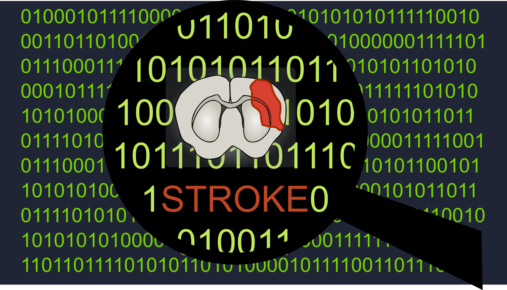
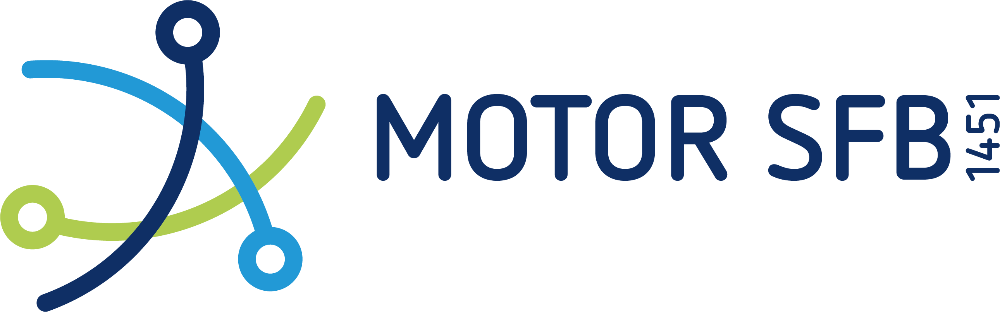
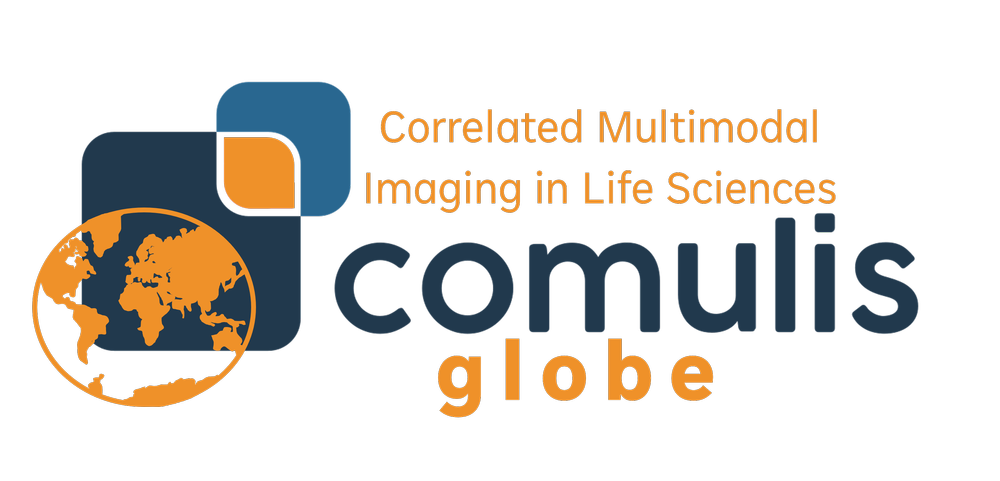
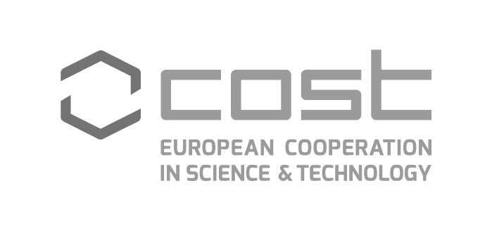
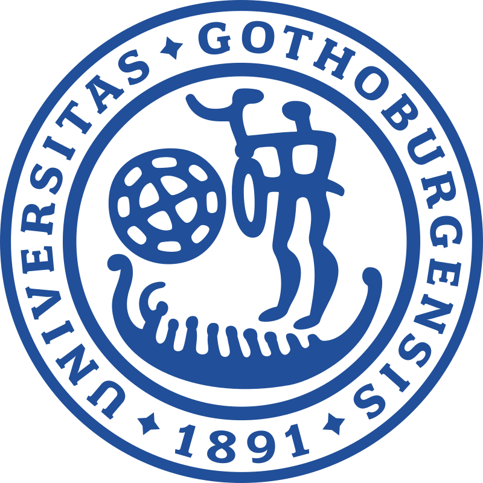
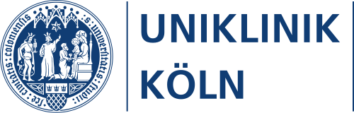
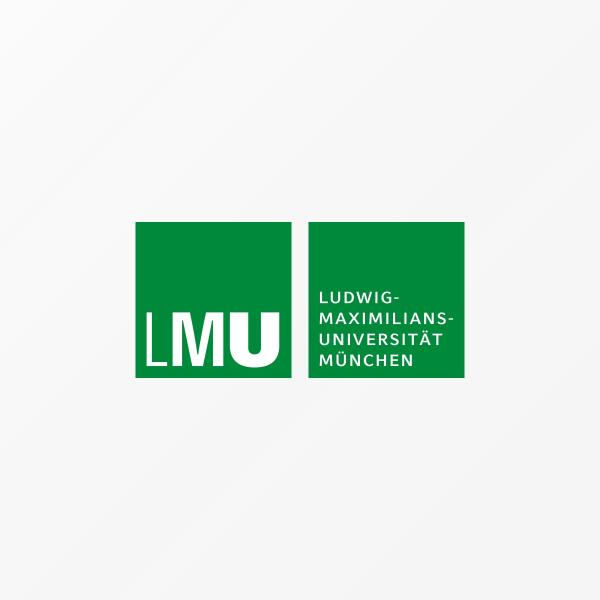

  

## Our Mission

One-third of stroke patients suffer from long-term disabilities, and functional recovery is often incomplete. By integrating advanced neurotechniques, such as in vivo MRI, viral tracing, and light sheet microscopy, we aim to uncover the cellular and neural circuit mechanisms underlying motor recovery after experimental stroke. Our research explores the development of motor deficits, such as spastic muscle tone, and creates innovative neuromodulation and regeneration paradigms to enhance endogenous plasticity mechanisms and improve stroke recovery. We are committed to open science, FAIR data workflows, and standardization initiatives, ensuring our <a href="https://gin.g-node.org/Aswendt_Lab">research data</a> and <a href="https://github.com/orgs/Aswendt-Lab/repositories">software projects</a> are publicly accessible.

 
## Supported by

  
  
  
  
  

## Collaboration partners

  

     
    Prof. Dr. Philipp Boehm-Sturm (Charité Berlin, Experimental Neurology)
  

  

    
    Prof. Dr. Michael Hanke (Forschungszentrum Jülich, INM-7)
  

  

    
    Prof. Maged Goubran (University of Toronto, Dept. of Medical Biophysics, Toronto, Canada)
  

  

    
    Dr. Giovanna Ielacqua (Novartis Pharma AG, Novartis Institutes for Biomedical Research, Basel, Switzerland)
  

  

    
    Dr. Christoph Leuze (Stanford University School of Medicine, Radiology, Stanford, USA)
  

  

    
    Prof. Milos Pekny and Prof. Marcela Pekna (University of Gothenburg, Dept. of Clinical Neurosciences, Gothenburg, Sweden)
  

  

    
    Prof. Dr. Dr. Adele Rüger, Prof. Dr. Lukas J. Volz (University Hospital Cologne, Department of Neurology)
  

  

    
    Prof. Dr. Dr. Anna-Sophia Wahl (Institute for Stroke and Dementia Research, LMU Klinikum and Institute of Anatomy, Munich)
  

