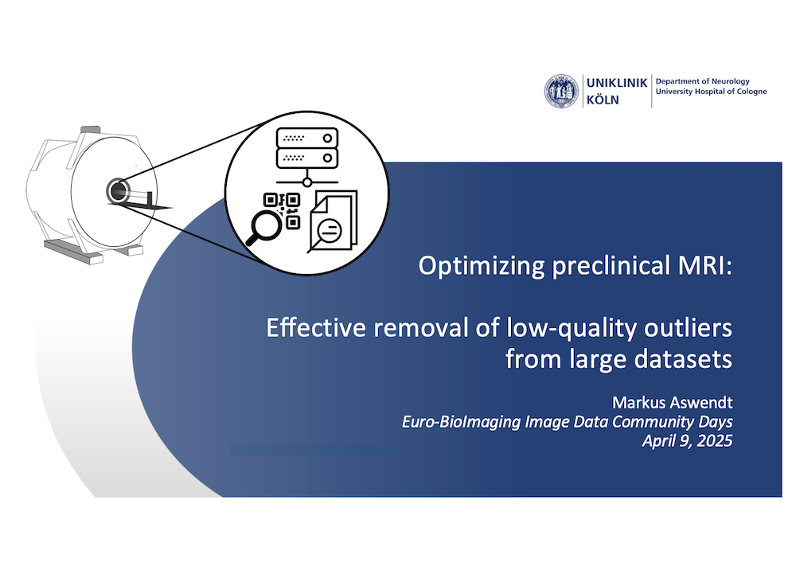
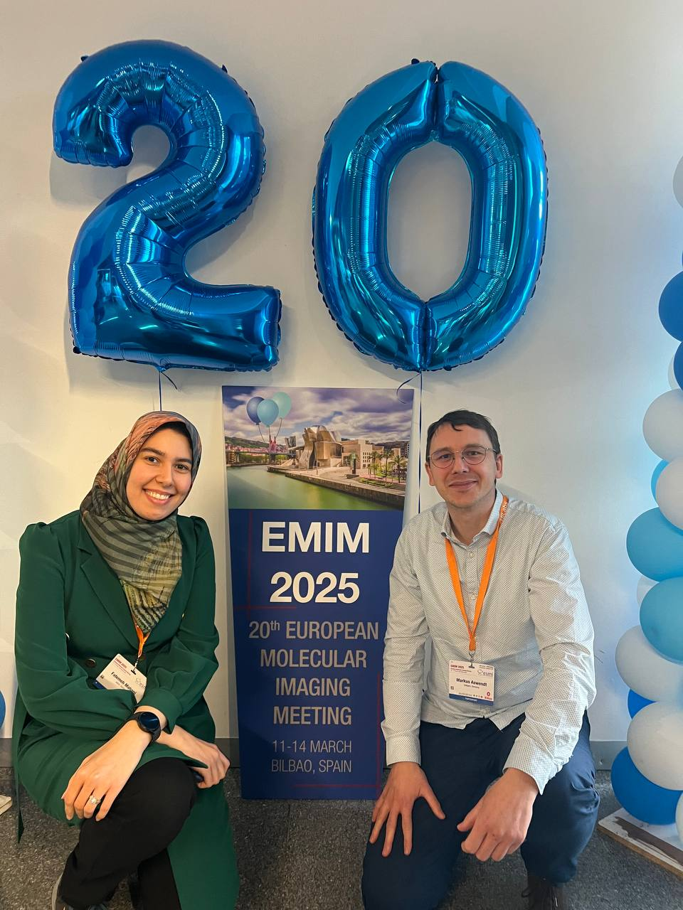
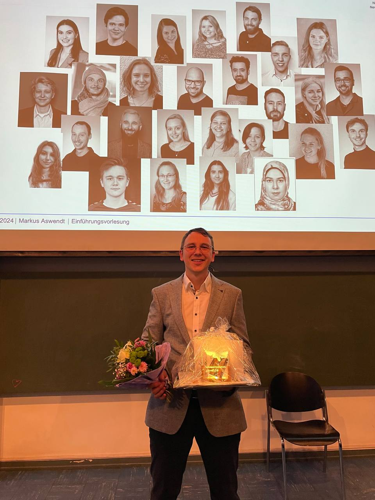

## 12/2025 PhD (the 3rd)
Aref received the PhD with highest praise, congratulations! 3.5 years of data curation, coding, discussion, learning, and fun (in variable order) come to an end. Exceptional work and output: 3 first author publications, 2 co-author and many more in preparation.  

  
  
  

## 04/2025 Paper alert
Aref's next publication is out! We provide evidence of proportional recovery in mice following a pronounced recovery rate. [Link](https://doi.org/10.1016/j.expneurol.2025.115180). Featured as <a href="https://www.crc1451.uni-koeln.de/wp-content/uploads/2025/05/CRC1451_Kalantari_PotM_04_2025_C01.pdf">CRC1451 Paper of the month </a> April 2025.  

## 03/2025 Invited talk
Markus contributed an invited talk at the <a href="https://www.eurobioimaging.eu/our-events/image-data-events/image-data-community-days/">EuroBioImaging </a> Image Data Community Days.  

  
  

## 03/2025 20th ESMI Annual Meeting
Fatemeh contributed a talk (the first at an international conference!); Markus presented the diffusion tract masks approach at <a href="https://e-smi.eu/meetings/emim/past-meetings/2025-bilbao/">ESMI Meeting </a> (Bilbao, Spain). 

  
  

## 12/2024 Inofficial best-of 2024

  
  
  
  
  

## 12/2024 SAMS & Red Hot 19F meeting
We enjoyed the special small animal imaging meeting, this time organized by the Functional Imaging Laboratory at the German Primate Center (DPZ)
in Goettingen. Aref won a poster prize and gave a very well responded talk about the AIDAqc pipeline. 

  
  
  
  

## 11/2024 ISN (Neuroprotection & Neurorepair Meeting) Potsdam
Markus contributed a talk about the new internal capsule stroke module, Aref presented the diffusion tract mask project as talk and the good/poor recovery classification as poster. 

  
  
  
  

## 10/2024 Introductory lecture
Markus gave his introductory lecture and celebrated the final step of the habilitation to become a Privatdozent in Experimental Neurology. 

  
  

## 10/2024 Invited lecture
Markus gave a lecture at the retreat of the <a href="https://www.uni-due.de/biome/">BIOME graduate school </a> (University Duisburg-Essen). 

  
  

## 10/2024 Markus and Aref attend ESMRMB conference in Barcelona
Markus contributed an invited talk at the preclinical MRI pre-congress and a lightning talk with poster presentation about diffusion tract masks. Aref presented a poster on recurrence plot. 

  
  
  
  

## 01/2024 NFDI4HEALTH Local data hub application successfull
Markus together with Anna Grönke (University Hospital Cologne, MeDIC) Oya Beyan and Ekaterina Kutafina (University of Cologne, Biomedical Informatics) receive funding to establish a translational stroke neuroimaging data hub at the University Hospital Cologne. 

## 03/2024 AMIRE Session at EMIM 2024
The <a href="https://github.com/Aswendt-Lab/MRI_Standardization_AIDAqc">AMIRE project</a> was initiated in 2023 by Markus Aswendt and Giovanna Ielacqua (Max Delbrück Center Berlin), both EMIM Study group: Standardization, as a collaborative effort to improve quality control, quality assurance procedures, standardization, and reproducibility in small animal MRI. 
The initiative is currently split into two projects: 1) the development of an automated quality control tool for retrospective identification of bad quality images from anatomical, structural and functional MRI, and 2) the quantification of cross-lab measurement stability using standardized MRI phantoms. 
In this first dedicated session, we have introduced the project and reported on the current status and future directions. As we were aware of the gap between preclinical and clinical efforts for standardization, we invited an expert in clinical MRI, Charlotte Robert (Paris-Saclay University), who summarized the current status and what had already been achieved. We then transitioned to the panel discussion with two controversial statements by Louise van der Weerd (Leiden University Medical Center) and Noam Shemesh (Champalimaud Centre for the Unknown), who argued for and against standardization, respectively.

  
  
  

## 12/2023 Inofficial best-of 2023

  
  
  
  
  
  
  
  
  

## 10/2023 COMULISglobe global showcase project receives funding
In collaboration with [Maged Goubran](https://sunnybrook.ca/research/team/member.asp?m=894&page=528) (Toronto, Canada) and [Christoph Leuze](https://profiles.stanford.edu/christoph-leuze) (Stanford, USA), we receive funding from the Chan Zuckerber Foundation and the COMULISglobe project to "Demystifiy white matter plasticity by cross-connectome mapping with in vivo diffusion imaging and light sheet microscopy". 

  

## 03/2023 INCF Neuroinformatics workshop
We organized a practical guide to overcome the reproducibility crisis in small animal neuroimaging: workflows, tools, and repositories. Thanks to our excellent contributors, the workshop was a great success. 
[GitHub Link to the workshop material:](https://github.com/grandjeanlab/INCF_preclinical/tree/main)

  

### Contributors

- **Markus Aswendt & Aref Kalantari** (Cologne, Germany): 
  - Translational stroke research
  - Development of mouse neuroimaging analysis, database, and sharing protocols
  - [GitHub](https://github.com/Aswendt-Lab)

- **Joanes Grandjean** (Nijmegen, The Netherlands): 
  - Developer of standardized fMRI protocols
  - Initiator of first rodent MRI multi-center studies
  - Advocate of MRI data sharing (BIDS)
  - [GitHub](https://github.com/grandjeanlab)

- **Gabriel Desrosiers-Gregoire** (Montreal, Canada): 
  - RABIES developer - open source image processing pipeline for rodent fMRI
  - [GitHub](https://github.com/CoBrALab/RABIES)

- **Michael Hanke & Michał Szczepanik** (Jülich, Germany): 
  - DataLad developer
  - [Website](https://www.psychoinformatics.de/software.html)

## 10/2023 First prize for Aref Kalantari at MRI Together Session
European Society for Magnetic Resonance in Medicine and Biology 2023 in Basel, Switzerland

  
  
  

## 07/2023 Invited talk at Charité Berlin
For the seminar series of the Department of Experimental Neurology, Markus gave a presentation on "Demystifying astrogliosis after cortical stroke in mice using functional connectivity analysis". Markus together with Aref and Fatemeh enjoyed a fruitful discussion with our long-standing collaboration partner Prof. Philipp Boehm-Sturm and colleagues. 

  
  
  

## 12/2022 Inofficial best of 2022
### Successfully completed master thesis:
- **Prisca Kuhnhäuser** (University of Cologne): _Identification and manipulation of spasticity-related extrapyramidal motor nuclei in mice_

### Successfully completed bachelor thesis:
- **Jule Ullert** (Hochschule Bonn-Rhein-Sieg): _Histological characterization of experimental internal capsule strokes_
- **Annika Vohn** (University of Cologne): _Characterization of secondary neurodegeneration in the spinal cord after cortical stroke_

  
  
  
  
  
  
  
  
  
  

## 12/2021 Inofficial best of 2021
### Successfully completed PhD thesis:
- **Frederique Wieters** (University of Cologne, Germany): _Neural circuits of spasticity after experimental stroke_

### Successfully completed master thesis:
- **Sebastian Kloubert** (University of Düsseldorf, Germany) _Automated classification of sensorimotor deficit in stroke mice_

### Successfully completed bachelor thesis:
- **Franziska Ziolkowski** (University of Düsseldorf, Germany): _Classification of motor deficits in beam walking using machine learning_ 

  
  
  
  
  

  
  

## 08/2020 First poster prize for Markus at EMIM 
Enhanced transhemispheric connectivity after cortical stroke in mice. 
See the post pitch here: 

<video width="640" height="360" controls>
  <source src="https://raw.githubusercontent.com/Aswendt-Lab/website/main/videos/PosterPitch_MarkusAswendt_v3.mp4" type="video/mp4">
  Your browser does not support the video tag.
</video>

## 12/2020 Inofficial best of 2020
### Successfully completed PhD thesis:
- **Niklas Pallast** (University of Cologne, Germany): _A versatile registration and analysis pipeline for multimodal brain imaging data_

### Successfully completed master thesis:
- **Jan Götz** (University of Cologne, Germany) _Recovery-related genes in cortical strokes_

### Successfully completed bachelor thesis:
- **Sebastian Kloubert** (University of Düsseldorf, Germany): _Automated movement analysis of mouse beam walking using neural networks_

## 12/2019 Inofficial best of 2019
### Successfully completed bachelor thesis:
- **Veronika Fritz** (University of Cologne, Germany) _Neural tracing in mice with cortical stroke_
