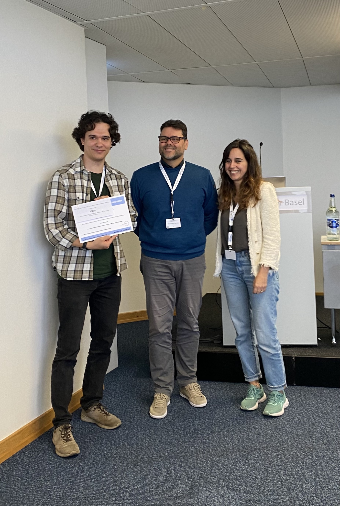
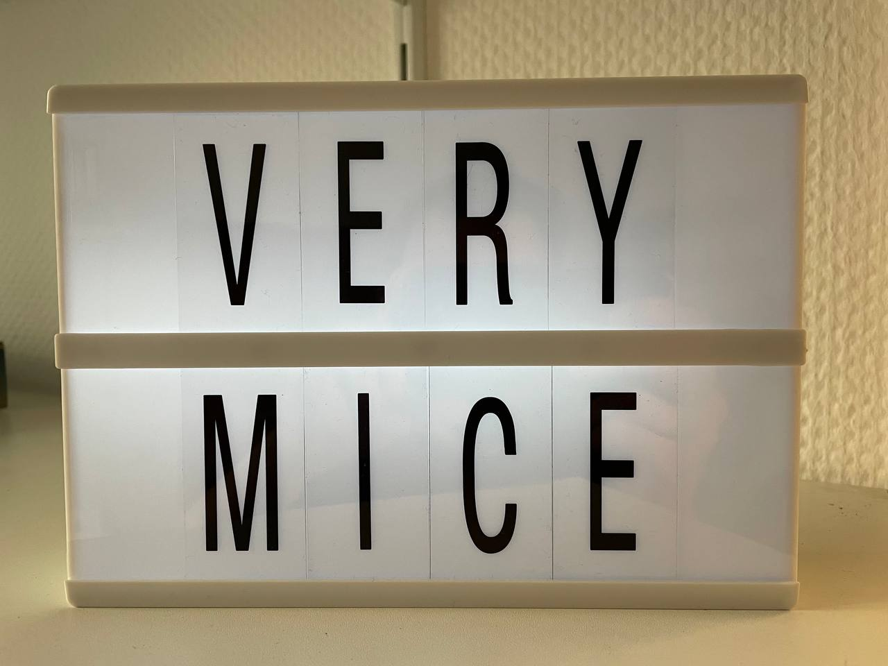

### 03/2024 AMIRE Session at EMIM 2024
The <a href="https://github.com/Aswendt-Lab/MRI_Standardization_AIDAqc">AMIRE project</a> was initiated in 2023 by Markus Aswendt and Giovanna Ielacqua (Max Delbrück Center Berlin), both EMIM Study group: Standardization, as a collaborative effort to improve quality control, quality assurance procedures, standardization, and reproducibility in small animal MRI. 
The initiative is currently split into two projects: 1) the development of an automated quality control tool for retrospective identification of bad quality images from anatomical, structural and functional MRI, and 2) the quantification of cross-lab measurement stability using standardized MRI phantoms. 
In this first dedicated session, we have introduced the project and reported on the current status and future directions. As we were aware of the gap between preclinical and clinical efforts for standardization, we invited an expert in clinical MRI, Charlotte Robert (Paris-Saclay University), who summarized the current status and what had already been achieved. We then transitioned to the panel discussion with two controversial statements by Louise van der Weerd (Leiden University Medical Center) and Noam Shemesh (Champalimaud Centre for the Unknown), who argued for and against standardization, respectively.

  
  
  

### 12/2023 Inofficial best-of 2023

  
  
  
  
  
  
  
  
  

### 10/2023 First prize for Aref Kalantari at MRI Together Session
European Society for Magnetic Resonance in Medicine and Biology 2023 in Basel, Switzerland

  
  
  

### 07/2023 Invited talk at Charité Berlin
For the seminar series of the Department of Experimental Neurology, Markus gave a presentation on "Demystifying astrogliosis after cortical stroke in mice using functional connectivity analysis". Markus together with Aref and Fatemeh enjoyed a fruitful discussion with our long-standing collaboration partner Prof. Philipp Boehm-Sturm and colleagues. 

  
  
  

### 12/2022 Inofficial best-of 2022

  
  
  
  
  
  
  
  
  
  

### 12/2021 Inofficial best-of 2021

  
  
  
  
  
  

