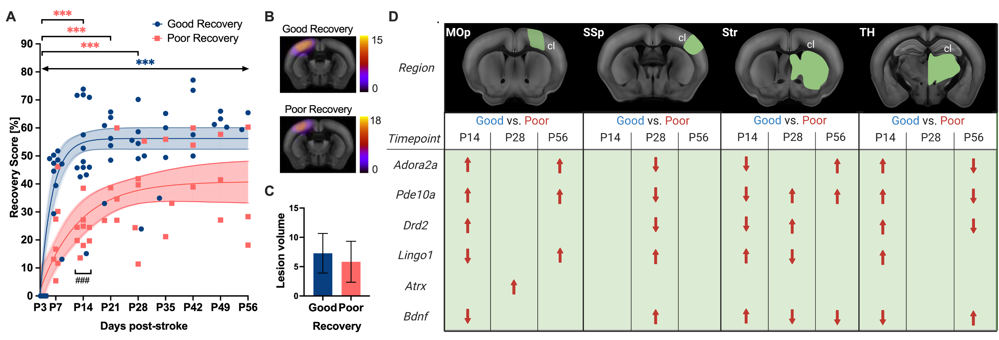
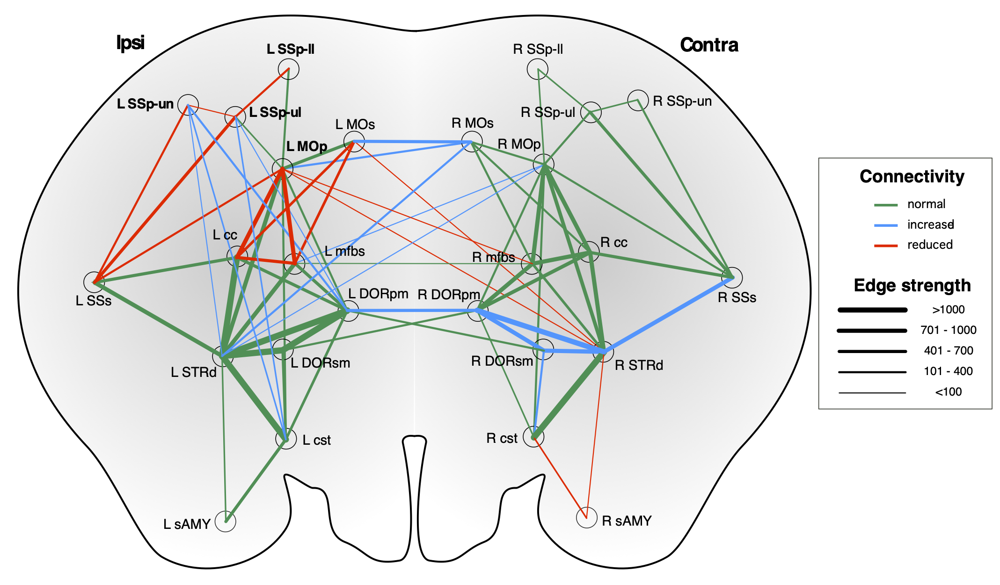
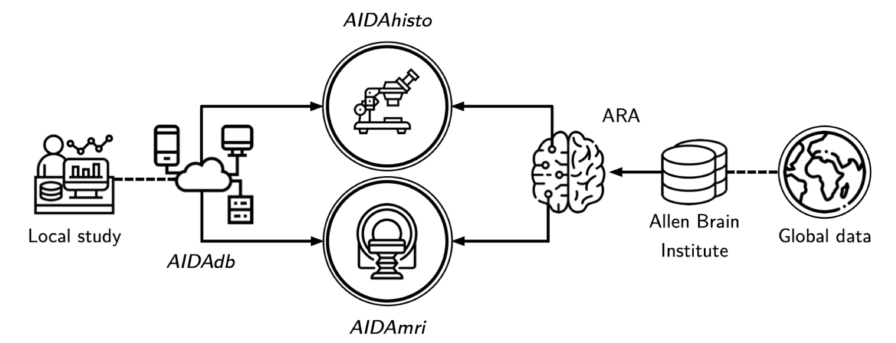

## Spontaneous recovery after stroke
Loss of function after stroke is caused by cell death and breakdown of the functional networks in the infarcted and connected brain regions. To some extent, the affected limb regains function, in a form of spontaneous recovery during the first 3 months after stroke. However, this recovery is generally incomplete and the underlying neural and molecular mechanisms are still unknown. In this project we are investigating brain/circuit activation patterns and analyse the transcriptome in the ipsi- and contralesional hemispheres of recovered vs. non-recovered mice after experimental stroke. 

On a molecular level, we have identified stroke recovery genes with region- and time-specific changes in gene expression related to spontaneous recovery after cortical stroke [Götz et al. Genes 2023](https://doi.org/10.3390/genes14020454): 

  

On a network level, we have mapped the dynamic changes in the sensorimotor network related to recovery after cortical stroke using DTI and graph theory [Pallast et al. Neuroimage 2021](https://doi.org/10.3390/genes14020454](https://doi.org/10.1016/j.neuroimage.2020.116873)):

  

## Internal capsule stroke and spasticity after stroke in mice
Spasticity is a common symptom after stroke, arising in about 30% of patients, and affecting the lower as well as upper limb. The spastic (abnormal) muscle tone appears in the first weeks after stroke onset and maladaptive processes lead to a manifestation of spasticity, which ultimately limits the success of rehabilitation. While previous studies investigated the abnormal intra-spinal processing, spasticity remains a result of damage to the primary motor regions. Therefore we are characterizing the cellular components and network changes which lead to spasticity after stroke to effectively develop opposing optogenetic and chemogentic stimulation paradigms.

## Data management of large, multimodal animal data 

To obtain valid scientific results in pre-clinical research, standardization of experimental protocols and data handling need to be set before starting the actual experiment. Efficient data management becomes more and more important with the increasing number and variety of experimental procedures. However, to date, preclinical research is still in a transition phase. While the recorded data type is predominantly electronic data, the documentation is still the lab notebook. We designed a database template which is useful for all labs working with laboratory animals and the adaption to specific research projects requires no prior scripting expertise [Pallast et al. Database 2018](https://doi.org/10.1093/database/bay124). The database works operating-system independent through the web browser and allows multiple user to work simultaneously. The data entry is monitored and restricted for particular tests according to the user management in order to keep for example users during the experiment blinded for the experimental group 
[Video tutorial](/videos/Database_Tutorial.mp4). Furthermore, we have established an efficient workflow to store and share the experimental data according to FAIR prinicples [Kalantari et al. Scientific Data 2023](https://doi.org/10.1038/s41597-023-02242-8).
[Video tutorial](https://static-content.springer.com/esm/art%3A10.1038%2Fs41597-023-02242-8/MediaObjects/41597_2023_2242_MOESM1_ESM.pdf)

  

    <embed src="pdf/Poster_RDB_Aswendt_v1.pdf" width="500" height="300" type="application/pdf">
     
    <a href="pdf/Poster_RDB_Aswendt_v1.pdf">[Database Poster]</a>
  

  
  

    <embed src="pdf/Poster_RDM_Final_AKalantari_EMIM.pdf" width="300" height="500" type="application/pdf">
     
    <a href="pdf/Poster_RDM_Final_AKalantari_EMIM.pdf">[RDM Poster]</a>
  

## The AIDA toolbox

  
  

  

Working with in vivo and ex vivo imaging at different spatial resolutions requires a common atlas registration for cross-modality comparisons. For example, if we detect connectivity change in primary motor cortex with MRI, it will be of interest to investigate the same brain area with histology. In order to merge in vivo MRI with 2D histology, we have created software pipelines for automated processing of structural and functional mouse brain MRI (AIDAmri) and automated cell counting - optimised for mouse brain histology and immunostainings (AIDAhisto). These pipelines include accurate approaches to register whole brain (MRI) and single slices (histology) respectively with the Allen Mouse Brain Atlas. 
With the Atlas-based Imaging Data Analysis Pipeline AIDA we provide a set of analysis tools for structural and functional MRI of the mouse brain. Please check out our different project repositories listed below!

  

    <embed src="pdf/Neuroinformatics_Aswendt_2022.pdf" width="300" height="500" type="application/pdf" />
     
    <a href="pdf/Neuroinformatics_Aswendt_2022.pdf">[AIDA Tools Poster]</a>
  

### [AIDA*mri*](https://github.com/Aswendt-Lab/AIDAmri)
AIDA*mri* is a fully automatized and containerized pipeline for anatomical, diffusion-weighted and functional MRI data processing. It provides raw data conversion and batch processing, including bias field correction, brain extraction and atlas registration, while organizing data according to the Brain Imaging Data Structure (BIDS[^1]) format. AIDA*mri* is exclusively available as a Docker[^2] image to allow for cross-platform usage and easy installation.

  

    <embed src="pdf/TOPIM2018_MA.pdf" width="300" height="500" type="application/pdf" />
     
    <a href="pdf/TOPIM2018_MA.pdf">[AIDA Tools Poster]</a>
  

### [AIDA*qc*](https://github.com/Aswendt-Lab/AIDAqc)

AIDA*qc* is an automated and simple Python tool for fast quality analysis of animal MRI. It is easily installable and provides a conda environment for fast and simple usage. Quality evaluation includes (temporal) signal-to-noise ratio ((t)SNR), motion artifacts, and spacial resolution homogeneity.
[Watch Video](https://www.youtube.com/watch?v=SP4sWW313DQ)

### [AIDA*histo*](https://github.com/Aswendt-Lab/AIDAhisto)
AIDA*histo* is a MATLAB tool for cell detection in immunostainings and histological stainings of mouse brain and spinal cord sections. It provides Allen Mouse Brain and Spinal Cord Atlas registration with microscopy files in ImageJ and automated cell counting.
### [AIDA*connect*](https://github.com/Aswendt-Lab/AIDAconnect)
AIDA*connect* is a comprehensive MATLAB toolbox for mouse brain MRI data analysis and connectivity analysis using graph theory.

[^1]: [https://bids.neuroimaging.io/](https://bids.neuroimaging.io/)
[^2]: [https://www.docker.com/](https://www.docker.com/)
