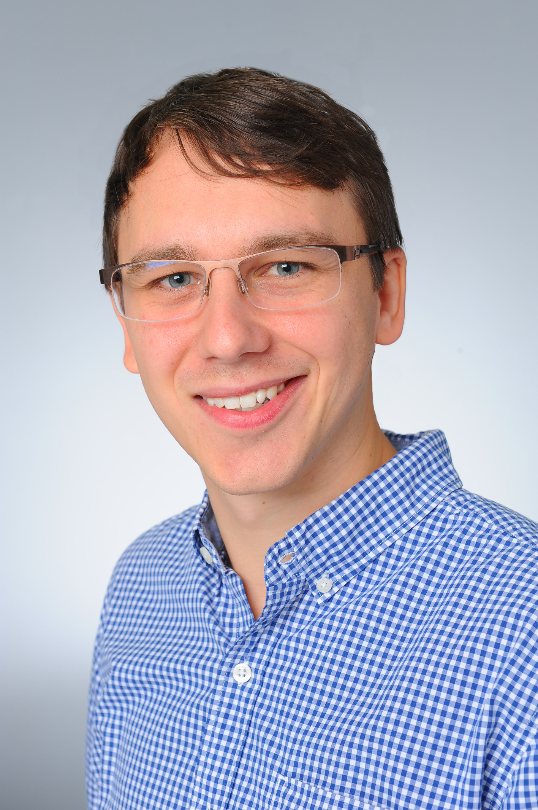
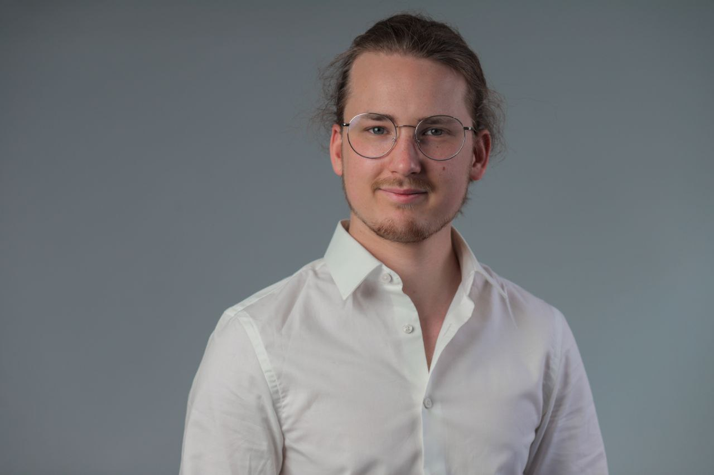
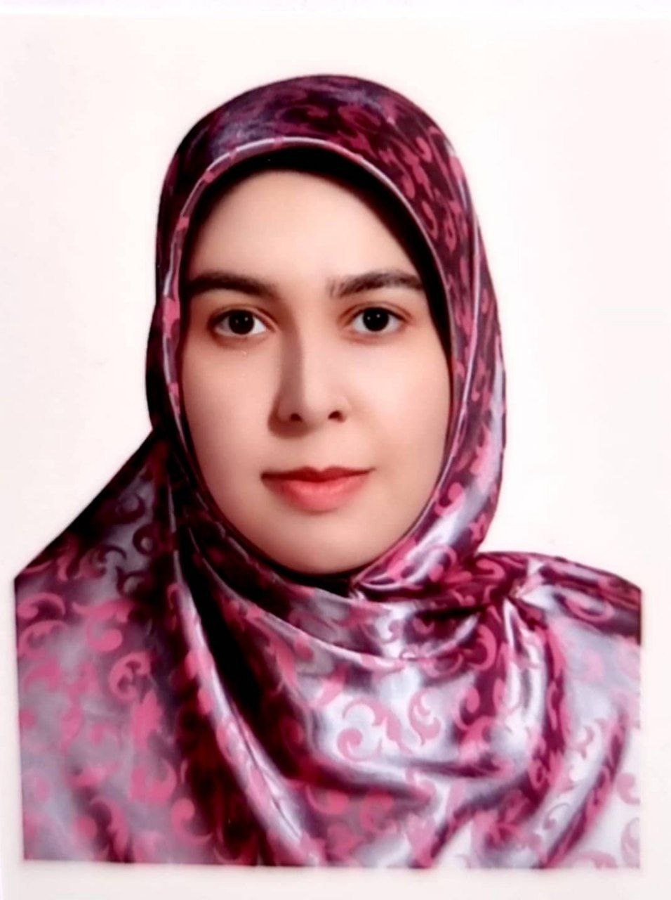
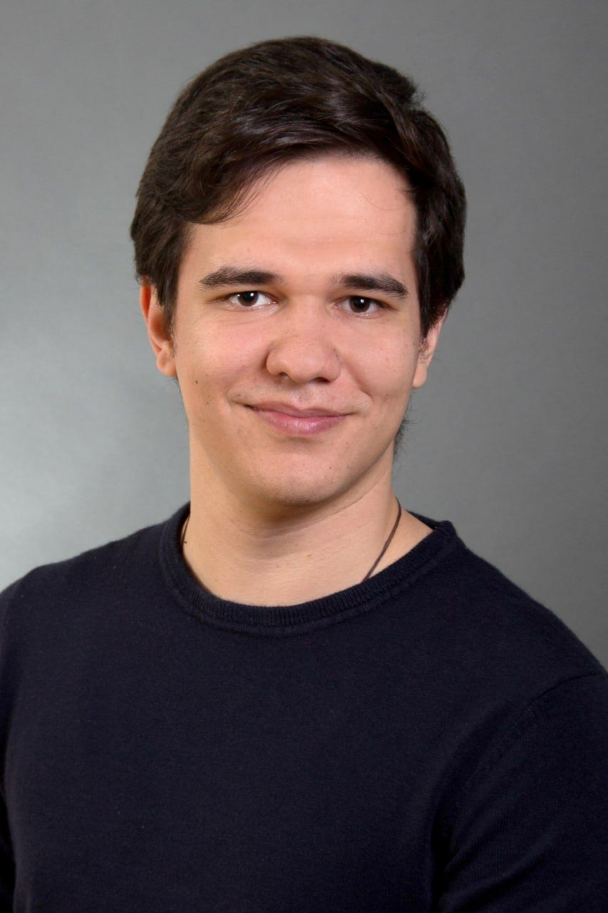

---
title: Team
layout: page
---

### Markus Aswendt

    
            Markus is an expert in MR neuroimaging and its application to investigate mechanisms of spontaneous recovery after stroke in mice. He holds a PhD in neuroscience and has worked in international labs and funding consortia. Markus is also the head of the central core facility Neuro-MRI of the University of Cologne.

 

### Daniel Mertens

    
            2023 – ongoing: Bachelor thesis on expanding AIDAmri for rat brain MRI and the Sigma rat atlas.

 

### Franziska Ziolkowski

    
            2023 – ongoing: Master thesis on recurrence plot quantification of dynamic functional connectivity changes after stroke related to motor recovery.

 

### Fatemeh Mahani

    
            2022 – ongoing: PhD thesis on structure-function coupling in relation to timing and stroke lesion size and location.

 

### Marko Schmelzer

    
            2022 – ongoing: Bachelor thesis on histological characterization of white matter changes in major.

 

### Aref Kalantari

    
            2021 – ongoing: PhD thesis on software to promote FAIR and quality control principles in small animal MRI.

 

## Alumni
### Carolin Hambrock
<table>
    <tr>
        <th>Year:</th>
        <td>2023-2024</td>
    </tr>
    <tr>
        <th>Position/field:</th>
        <td>Master thesis (Neuroscience): Spontaneous recovery after ischemic stroke: effects of stroke location and reactive astrocytes on thalamic secondary neurodegeneration in mice</td>
    </tr>
</table>

### Thomas Kühnel
<table>
    <tr>
        <th>Year:</th>
        <td>2023</td>
    </tr>
    <tr>
        <th>Position/field:</th>
        <td>Student assistant: histology</td>
    </tr>
    <tr>
        <th>Next position:</th>
        <td>Master of Biological Sciences (University of Cologne)</td>
    </tr>
</table>

### Luca Ruthe
<table>
    <tr>
        <th>Year:</th>
        <td>2023-2024</td>
    </tr>
    <tr>
        <th>Position/field:</th>
        <td>Bachelor thesis (Neuroscience): Characterization of secondary neurodegeneration in white matter tracts after experimental stroke</td>
    </tr>
    <tr>
        <th>Next position:</th>
        <td>Internship pharmaceutical industry</td>
    </tr>
</table>

### Marc Schneider
<table>
    <tr>
        <th>Year:</th>
        <td>2023-2024</td>
    </tr>
    <tr>
        <th>Position/field:</th>
        <td>Student assistant: AIDA tools support and further development (adding BIDS-compatibility)</td>
    </tr>
    <tr>
        <th>Next position:</th>
        <td>Master studies</td>
    </tr>
</table>

### Elizabete Vetra
<table>
    <tr>
        <th>Year:</th>
        <td>2023</td>
    </tr>
    <tr>
        <th>Position/field:</th>
        <td>Student assistant: histology</td>
    </tr>
    <tr>
        <th>Next position:</th>
        <td>Bachelor studies in Neuroscience (University of Cologne)</td>
    </tr>
</table>

### Léon Schulte-Holtey
<table>
    <tr>
        <th>Year:</th>
        <td>2022-2023</td>
    </tr>
    <tr>
        <th>Position/field:</th>
        <td>Master thesis (Biology): Chemogenetic manipulation of the rubrospinal tract in mice</td>
    </tr>
    <tr>
        <th>Next position:</th>
        <td>Master studies in Neuroscience (University of Cologne)</td>
    </tr>
</table>

### Victor Vera Frazão
<table>
    <tr>
        <th>Year:</th>
        <td>2022-2024</td>
    </tr>
    <tr>
        <th>Position/field:</th>
        <td>Research assistant: AIDA tools support and further development (debugging and containerization); database maintenance</td>
    </tr>
</table>

### Annika Vohn
<table>
    <tr>
        <th>Year:</th>
        <td>2022</td>
    </tr>
    <tr>
        <th>Position/field:</th>
        <td>Bachelor thesis: Characterization of secondary neurodegeneration in the spinal cord after experimental stroke</td>
    </tr>
    <tr>
        <th>Next position:</th>
        <td>Master thesis (lab of Frank Bradke, Bonn)</td>
    </tr>
</table>

### Tim Fleiner
<table>
    <tr>
        <th>Year:</th>
        <td>2021</td>
    </tr>
    <tr>
        <th>Position/field:</th>
        <td>Internship: AIDAmri</td>
    </tr>
</table>

### Prisca Kuhnhäuser
<table>
    <tr>
        <th>Year:</th>
        <td>2021-2022</td>
    </tr>
    <tr>
        <th>Position/field:</th>
        <td>Master thesis: Identification and manipulation of spasticity-related extrapyramidal motor nuclei in mice</td>
    </tr>
    <tr>
        <th>Next position:</th>
        <td>PhD student (lab of Frank Johannes Vogt, University of Cologne)</td>
    </tr>
</table>

### Jule Ullert
<table>
    <tr>
        <th>Year:</th>
        <td>2021-2023</td>
    </tr>
    <tr>
        <th>Position/field:</th>
        <td>Bachelor thesis (Biology)</td>
    </tr>
</table>

### Philip Baxter Aßmann
<table>
    <tr>
        <th>Year:</th>
        <td>2020-2021</td>
    </tr>
    <tr>
        <th>Position/field:</th>
        <td>Student assistant: histology</td>
    </tr>
</table>

### Jan Götz
<table>
    <tr>
        <th>Year:</th>
        <td>2020-2022</td>
    </tr>
    <tr>
        <th>Position/field:</th>
        <td>Research assistant and master thesis: Longitudinal gene expression analysis in experimental stroke</td>
    </tr>
    <tr>
        <th>Next position:</th>
        <td>PhD student (lab of Frank Johannes Vogt, University of Cologne)</td>
    </tr>
</table>

### Sebastian Kloubert
<table>
    <tr>
        <th>Year:</th>
        <td>2020-2021</td>
    </tr>
    <tr>
        <th>Position/field:</th>
        <td>Bachelor thesis (Biology): Automated movement analysis of mouse beam walking using neural networks</td>
    </tr>
</table>

### Leon Scharwächter
<table>
    <tr>
        <th>Year:</th>
        <td>2020-2021</td>
    </tr>
    <tr>
        <th>Position/field:</th>
        <td>Student assistant: AIDA tools</td>
    </tr>
</table>

### Mayan Baues
<table>
    <tr>
        <th>Year:</th>
        <td>2020-2022</td>
    </tr>
    <tr>
        <th>Position/field:</th>
        <td>Student assistant: histology</td>
    </tr>
    <tr>
        <th>Next position:</th>
        <td>Research associate (Lab of Michael Wenzel, University Hospital Bonn)</td>
    </tr>
</table>

### Nicole Kuschel
<table>
    <tr>
        <th>Year:</th>
        <td>2019-2021</td>
    </tr>
    <tr>
        <th>Position/field:</th>
        <td>Student assistant: video analysis</td>
    </tr>
</table>

### Mayan Baues
<table>
    <tr>
        <th>Year:</th>
        <td>2018-2021</td>
    </tr>
    <tr>
        <th>Position/field:</th>
        <td>Student assistant and Bachelor thesis: Neuronal tracing in mice with cortical stroke</td>
    </tr>
    <tr>
        <th>Next position:</th>
        <td>PhD student in the lab of Natalia Kononenko (University of Cologne)</td>
    </tr>
</table>

### Alina Jakobs
<table>
    <tr>
        <th>Year:</th>
        <td>2018</td>
    </tr>
    <tr>
        <th>Position/field:</th>
        <td>Student assistant: histology</td>
    </tr>
</table>

### Olivia Käsgen
<table>
    <tr>
        <th>Year:</th>
        <td>2018-2020</td>
    </tr>
    <tr>
        <th>Position/field:</th>
        <td>Biological technical assistant</td>
    </tr>
</table>

### Joshua Strelow
<table>
    <tr>
        <th>Year:</th>
        <td>2018-2019</td>
    </tr>
    <tr>
        <th>Position/field:</th>
        <td>Student assistant: behavior analysis</td>
    </tr>
    <tr>
        <th>Next position:</th>
        <td>PhD student (Lab of Michael Barbe, University Hospital Cologne)</td>
    </tr>
</table>

### Marieke Nill
<table>
    <tr>
        <th>Year:</th>
        <td>2017-2020</td>
    </tr>
    <tr>
        <th>Position/field:</th>
        <td>Biological technical assistant</td>
    </tr>
    <tr>
        <th>Next position:</th>
        <td>BTA (Lab of Roland Ullrich, University Hospital Cologne)</td>
    </tr>
</table>

### Niklas Pallast
<table>
    <tr>
        <th>Year:</th>
        <td>2017-2020</td>
    </tr>
    <tr>
        <th>Position/field:</th>
        <td>PHD thesis: A versatile registration and analysis pipeline for multimodal brain imaging data</td>
    </tr>
    <tr>
        <th>Next position:</th>
        <td>Head of Product Management (<a href="https://www.synlab.de/" title="SYNLAB Holding Deutschland GmbH">SYNLAB Holding Deutschland GmbH</a>)</td>
    </tr>
</table>

### Frederique Wieters
<table>
    <tr>
        <th>Year:</th>
        <td>2017-2021</td>
    </tr>
    <tr>
        <th>Position/field:</th>
        <td>PHD thesis: Evaluation of spasticity in experimental models of ischemic stroke</td>
    </tr>
    <tr>
        <th>Next position:</th>
        <td>Medical science Liaison Manager und CIDP (<a href="https://www.argenx.de/" title="Argenx">Argenx</a>)</td>
    </tr>
</table>
